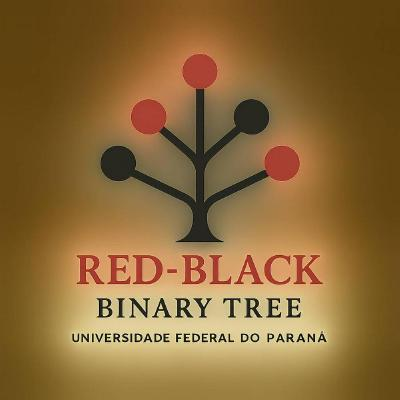

  <h1>Red-Black Tree</h1>

<h2>Desenvolvido na matéria de Algoritmos e Estruturas de dados 3 (Developed in the Algorithms & Data Structures III course)</h2>

<h2>Antonio da Ressurreição Filho and Matheus Gastal Magalhaes, students in the third semester of Computer Science at the Federal University of Paraná (UFPR).</h2>

## Professor: [Dr. Eduardo Cunha de Almeida.](https://www.inf.ufpr.br/eduardo/)

  

# Português:

O trabalho desenvolvido na disciplina de Algoritmos e Estruturas de Dados 3 consiste em uma árvore rubro-negra, a qual tem diversas propriedades que fazem dela ser única. O trabalho foi feito em dupla na
linguagem C e teve participação ativa dos dois membros em toda parte de código. a bibliografia usada para se fazer a criação desse trabalho foi: Algoritmos - Teoria e prática, Cormen, Leiserson, Rivest, Stein.

Ele foi dividido em 3 arquivos:
- "redblack.h": arquivo criado para a declaração das estruturas de dados e esqueleto das funções utilizadas ao longo do trabalho.
- "redblack.c": arquivo criado para se fazer as funções contidas em todo o programa, como de inserção e remoção.
- "main.c": arquivo criado para ser executadas todas as funções e estruturas de dados desenvolvidas no projeto.

# English:

The work developed in the course Algorithms and Data Structures 3 consists of a Red-Black Tree, which has several properties that make it unique. The project was done in pairs using the C programming language, 
and both members actively participated in all parts of the code. The bibliography used to create this project was: Introduction to Algorithms by Cormen, Leiserson, Rivest, and Stein.

The project was divided into three files:
- "redblack.h": a file created for the declaration of data structures and the skeleton of the functions used throughout the project.
- "redblack.c": a file created to implement the functions used in the program, such as insertion and deletion.
- "main.c": a file created to execute all the functions and data structures developed in the project.
